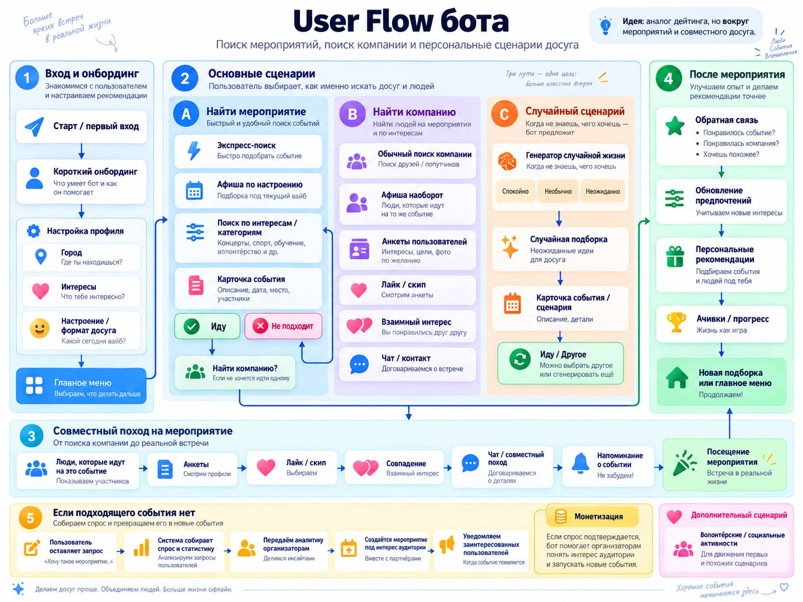
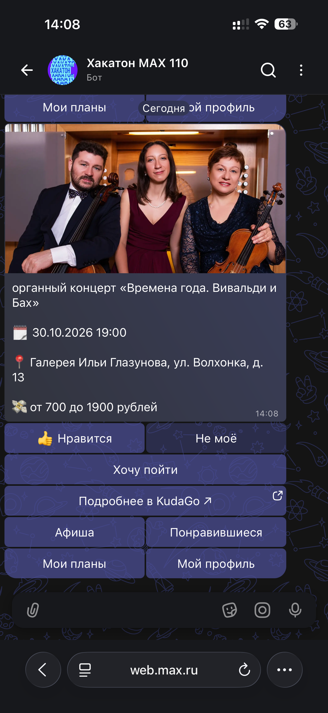
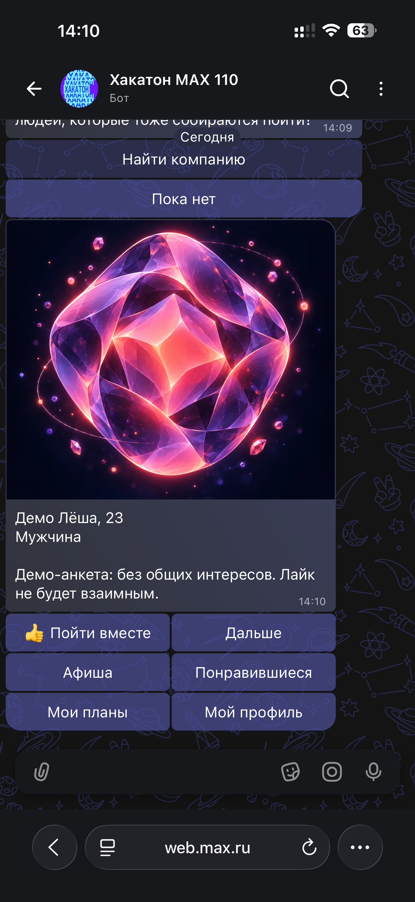
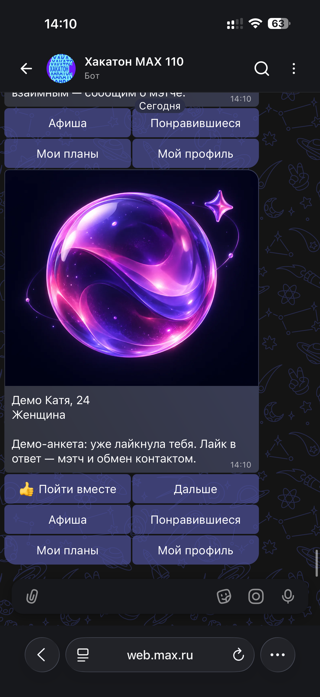

# ДвижМАКС - product case study

Продуктовый кейс хакатона MAX: чат-бот, который помогает выбрать мероприятие в Москве и найти компанию среди людей, которые **уже планируют пойти на то же событие**.

> Моя роль: **Product Lead / Product Manager**. Этот репозиторий показывает мою продуктовую работу. Backend разрабатывался Tech Lead команды; ссылка на командный код приведена ниже.

## Проблема

Разведочный опрос команды (n=82, нерепрезентативная выборка) показал:

- **62,2%** респондентов хотя бы раз за последние 3 месяца не пошли на понравившееся событие из-за отсутствия компании;
- **41,5%** сталкивались с этим неоднократно;
- только **7,3%** обычно ищут компанию в чатах/сообществах;
- среди респондентов 18+ проблема встретилась у **61,3%**.

Дополнительно команда провела 3 интервью, которые помогли определить границы целевой аудитории и не позиционировать решение как продукт «для всех».

## Моя зона ответственности

- продуктовая концепция и границы MVP;
- пользовательское исследование: анкета, анализ результатов, интервью;
- JTBD и продуктовая гипотеза;
- формирование и приоритизация требований;
- user flow и UX-тексты;
- координация команды из 4 человек;
- QA и E2E-проверки ключевых сценариев;
- презентация продукта и подготовка к защите.

## Решение

Основной принцип - **event-first, а не dating-first**:

1. пользователь выбирает событие;
2. добавляет его в планы;
3. при желании запускает поиск компании;
4. видит людей с тем же планом и общие интересы;
5. взаимный выбор создаёт мэтч;
6. после мэтча пользователи добровольно обмениваются контактами.

## Что было реализовано командой

- персональная афиша событий Москвы;
- профиль и интересы пользователя;
- планы и реакции на события;
- поиск компании внутри выбранного события;
- взаимный мэтч и добровольный обмен контактом;
- demo-flow для воспроизводимой проверки сценария;
- ручная E2E-проверка на двух аккаунтах MAX.

Примеры интерфейса:

| Афиша | Поиск компании | Демо мэтча |
|---|---|---|
|  |  |  |

## Исследовательские артефакты

- [Краткие результаты исследования](docs/research-summary.md)
- [JTBD, гипотеза и требования MVP](docs/product-requirements.md)
- [Метрики пилота](docs/pilot-metrics.md)

Исходные ответы респондентов и контактные данные **не публикуются**.

## Командная техническая реализация

Командный репозиторий backend: https://github.com/akimjlord-p/dvizhmax

Технический стек командной реализации: Python, PostgreSQL, Redis, SQLAlchemy, Alembic, Docker Compose, KudaGo API, Yandex AI Studio, MAX Bot API.

## Что я вынес из проекта

Проект дал практику полного продуктового цикла: от выявления проблемы и исследования до требований, MVP, тестирования и защиты. Главный вывод - не расширять функциональность «на всякий случай», а связывать каждое решение с подтверждённой проблемой пользователя и измеримой гипотезой.
